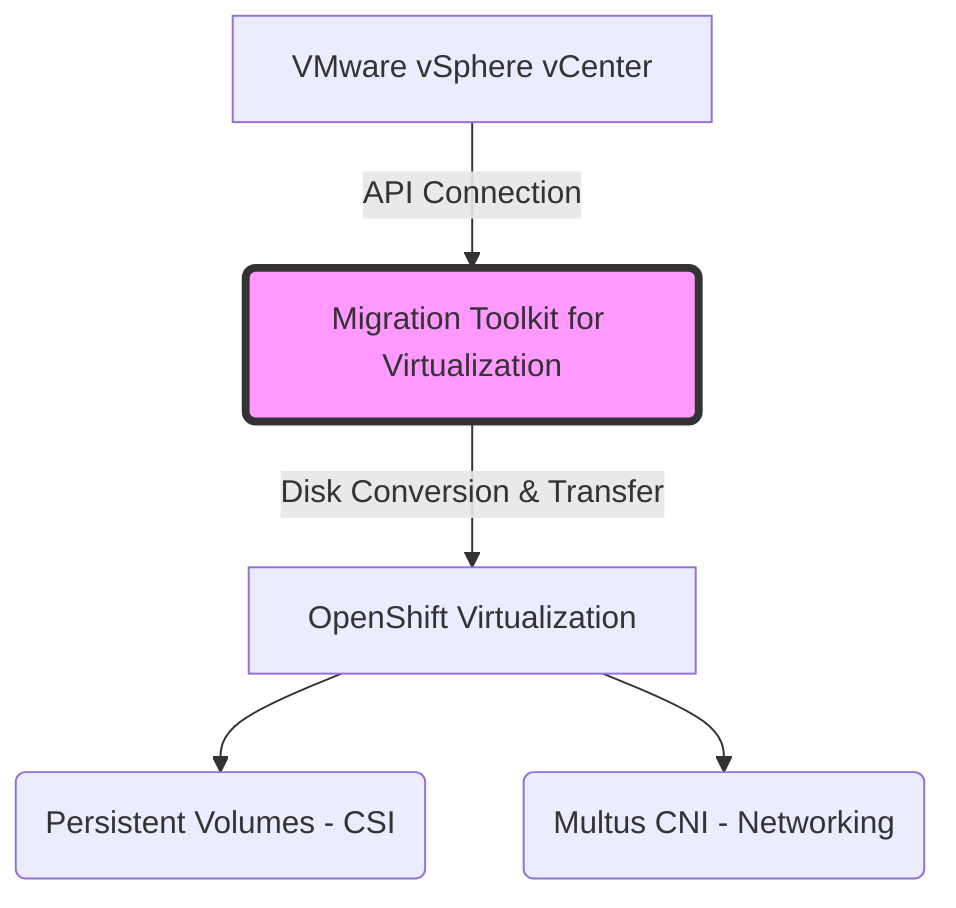

# VMware to OpenShift Virtualization (KubeVirt) Migration Strategy

This document outlines the architectural approach for migrating legacy virtual machines from VMware vSphere to a modern Hybrid Workload Platform (OpenShift Virtualization / KubeVirt).

**Author**: OCP Engineer Candidate

## 1. Migration Toolkit for Virtualization (MTV)
The primary tool used for this migration is Red Hat's **Migration Toolkit for Virtualization (MTV)**. MTV automates the migration of virtual machines at scale, converting disk formats and ensuring network and storage mapping.

## 2. Migration Architecture

## 3. Migration Phases

### Phase 1: Prerequisites & Provider Setup
- Install the MTV Operator from the OpenShift OperatorHub.
- Create a **Source Provider** for VMware (Requires vCenter URL, Username, Password/Token stored in a Kubernetes Secret).
- Create a **Target Provider** (The local OpenShift / KubeVirt cluster).

### Phase 2: Mapping Resources
- **Network Mapping**: Map VMware vSwitches/PortGroups to Kubernetes NetworkAttachmentDefinitions (Multus CNI) so the VM retains its network identity or joins the correct pod network.
- **Storage Mapping**: Map VMware Datastores to the target Kubernetes StorageClasses (e.g., Ceph RBD, ODF, or NFS).

### Phase 3: Migration Plan Execution
- Create a **Migration Plan** selecting the specific VMs.
- **Warm Migration** (Recommended for minimal downtime):
  - MTV copies the base disk while the VM is still running in VMware.
  - Periodic snapshots sync delta changes.
  - During the cutover window, the VMware VM is powered off, the final snapshot is synced, and the KubeVirt VM is powered on.
- **Cold Migration**: The VMware VM is powered off first, and the data is transferred completely before booting in OpenShift.

## 4. Post-Migration Validation
- Verify the `VirtualMachine` status (`Running`).
- Validate application functionality and performance using Prometheus metrics.
- Configure GitOps (ArgoCD) to take over the lifecycle management of the newly migrated VM manifest.
